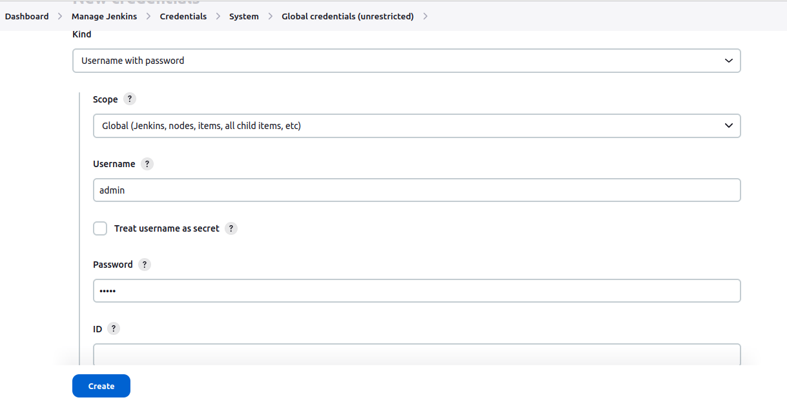
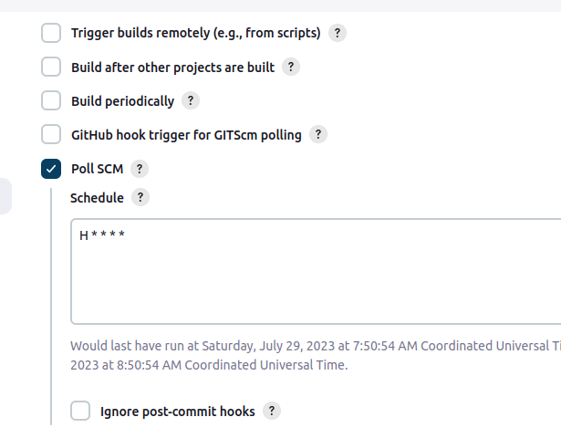

**Install Plugins**
- In the jenkins web ui, go to dashboard -> manage jenkins -> plugins -> available plugins
- Search for "Deploy to container plugin" and "Maven Integration plugin" and install them.

**Add Credentials**
- Navigate to Dashboard -> Manage Jenkins -> Credentials -> System -> Global credentials (unrestricted)
- Click on add credentials, add a username with password credentials with the username and password previously added to tomcat.



- Create a ssh public private key pair.
> By running
```
ssh-keygen -t rsa
```
- Navigate to Dashboard -> Manage Jenkins -> Credentials -> System -> Global credentials (unrestricted)
- Click on add credentials, add a SSH username with private key credential, use jenkins for username, select enter directly under Private Key, copy the private key just generated and paste it there, click on create.


- Add the public key to the github repository which has to be deployed. Go to the repository in your Github account -> Settings -> Deploy keys page. Paste the public key here.


**Creating Job**
- Click on add new item in the dashboard, select Freestyle project, provide a job name, click on ok.
- Under General, click on github project provide github project url.


- Under Source Code Management, click on git provide the github project url, select the ssh key credential with username 'jenkins'.


- Under Build Triggers, select Poll SCM and enter `H * * * *`.



- Under Build Environment, select Delete workspace before build starts.


- Under Build Steps, add Invoke top-level Maven targets, in goals enter `clean compile package`, in POM under advanced enter "starter\_code/pom.xml".


- Under Post Build Actions, select Deploy war/ear to a container, enter "\*\*/\*.war" in WAR/EAR files, enter "ecom" in context path.


- In containers add Tomcat 9.x Remote, select the username password credential for the tomcat in the credentials selection, enter the host and port (using private ip) of the tomcat container in the Tomcat URL.


- Save the job.

**Building Testing And Deploying**
- Click on build now in your job view page. After completion of the process success status can be seen.
- The job status can be also seen in the dashboard.


- The application runs successfully.


