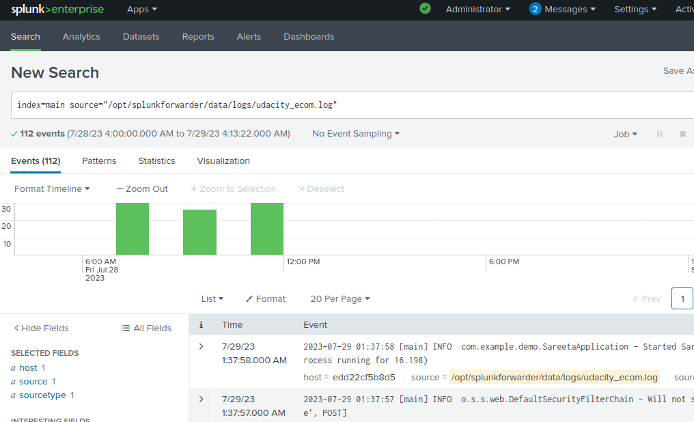

**Installing an EC2 instance**

- Create a EC2 instance, choose medium size and ubuntu os, configure firewall appropriately.
- Use ssh key to access the EC2 instance.
- Verify if the instance is listed in the aws EC2 instances menu.


**Installing Splunk Enterprise**

- Install the splunk enterprise by searching the market place in aws, go with the defaults, use the vendor recommended firewall, choose medium size and an ssh key.
- Follow the given instructions to login to the splunk web ui of the installed splunk enterprise instance, it is available at 8000 port.


*Script paths are relative to the root of the project* \
*Install the following into the EC2 instace created in the first instruction.*

**Install Docker**

- Install docker by following the instructions [here](https://docs.docker.com/engine/install/ubuntu/).
- Run `sudo docker run hello-world` to verify the docker installation.


**Installing Tomcat**

Use [backend/tomcat-run.sh](../backend/tomcat-run.sh) to install, run and configure tomcat.
>Run it as:
```
cd backend \
sudo bash tomcat-run.sh
```
- It will be installed and run in a docker container, and will be configured to make it ready to accept deployments.
- It also configures a docker volume (backend-data) to accept the logs from the application deployed to the tomcat server.
- The path to this directory (backend-data) within the tomcat server is available in the environment variable (ROOT\_DATA\_DIR) which can be used to configure the application that is to be deployed to log in that location.
- The tomcat server is available at port 8888, navigate to /manager endpoint, use the username and password given in [backend/tomcat/conf/tomcat-users.xml](../backend/tomcat/conf/tomcat-users.xml) to authenticate.


**Installing Universal Forwarder**

Use [backend/universal-forwarder-run.sh](../backend/universal-forwarder-run.sh) to install, run and configure universal forwarder.
>Run it as:
```
sudo bash backend/universal-forwarder-run.sh << private ip of the splunk enterprise instance >>
```
- It requires the private ip of the splunk enterprise EC2 instance to start the process.
- It monitors the (backend-data) docker volume and sends the events to the provided splunk enterprise instance at 9997 port.
- The events will be available in the main index of the provided splunk enterprise instance.
- Navigate to Apps -> Search & Reporting, and search for `index="main" source="/opt/splunkforwarder/data/logs/udacity_ecom.log"` and the application logs of the ecommerce app deployed to tomcat server should be available.



**Installing Jenkins**

Use the scripts in the [jenkins](../jenkins) directory to install and run jenkins, these scripts are as per the instructions at [here](https://www.jenkins.io/doc/book/installing/docker/).
>Run it as:
```
cd jenkins \
sudo bash jenkins-docker-run.sh \
sudo bash myjenkins-blueocean-run.sh
```
- Jenkins will be available at 8080 port.
- Enter the jenkins container and extract the pass key.
>By running:
```
sudo docker exec -it jenkins-blueocean bash
cat /var/jenkins_home/secrets/initialAdminPassword
```
- The pass key will be printed to the screen take that and provide to the jenkins ui to authenticate.
- Click install suggested plugins, create the jenkins user.
- The home page of jenkins will be shown.


***Troubleshooting:***

If the logs are not apprearing in the splunk search, then please check and correct the linux file permissions of the files and folders in the shared volume.
