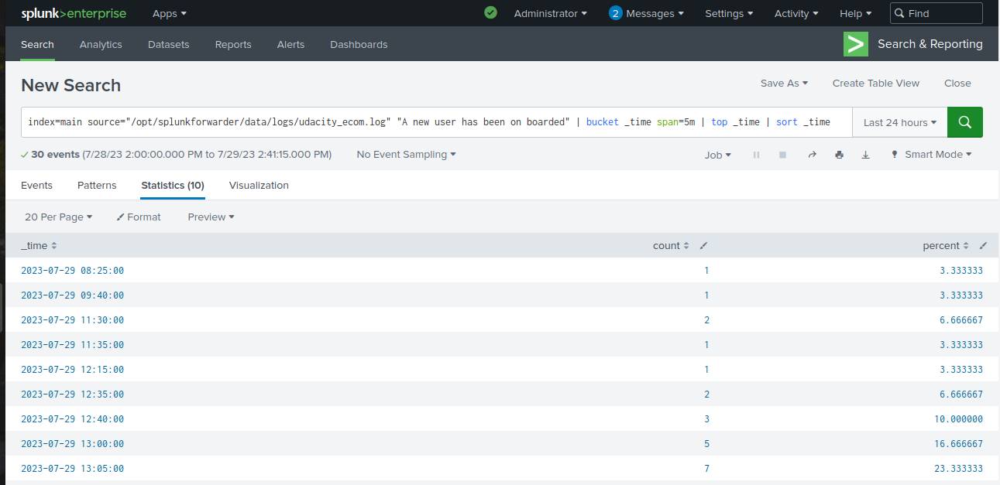
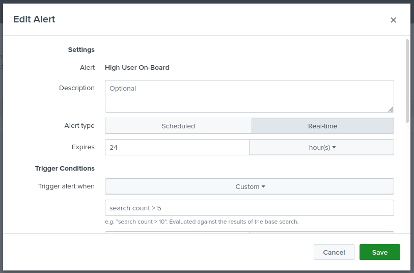
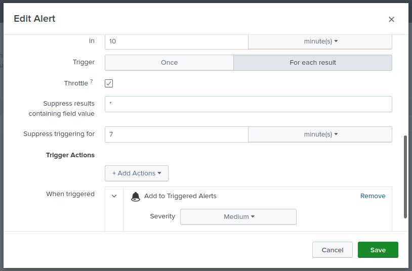
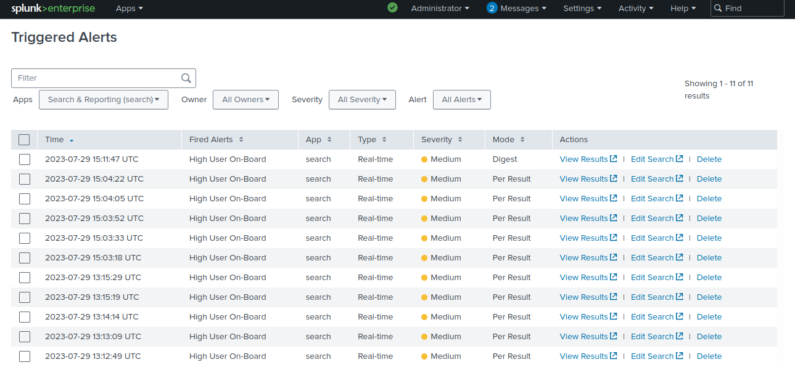
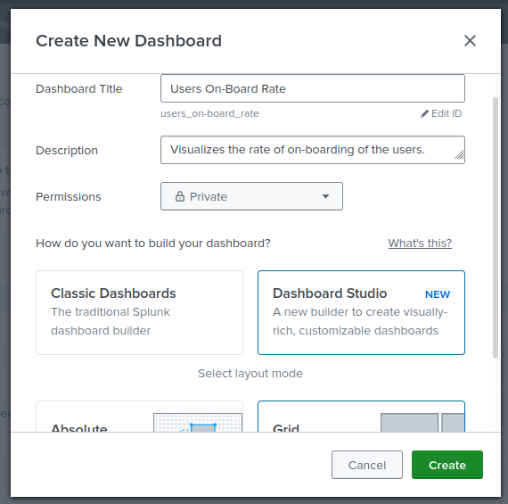
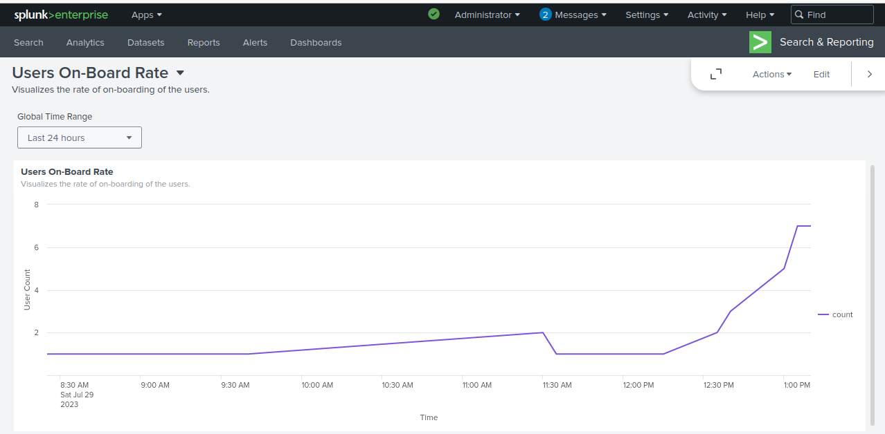
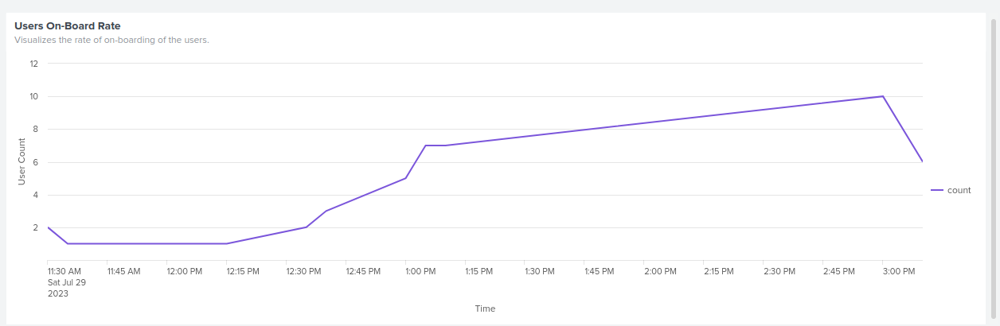

**Searching**
- The following query can be used to get the number of users added for every five minutes.
```
index=main source="/opt/splunkforwarder/data/logs/udacity_ecom.log" "A new user has been on boarded" | bucket _time span=5m | top _time | sort _time
```
- It filters out the user onboarded logs that come from the log file of the ecom application.
- Then groups them by 5 minutes interval, and retrieves the count of the logs for every five minutes, sorted by the time of the log.

- Navigate to Apps -> Search & Reporting, then enter the above SPL query, click search to see the search results.



**Alerts**
- In the Search page click on Save As -> Alert, enter the alert details and create the alert.
- In trigger alert when enter `search count > 5` to trigger the alert when the users on-boarded count surpasses five, in the given interval of time.



- Add an trigger action 'triggered alerts', to receive an alert in the triggered alerts page.



- Triggered alerts are shown in the triggered alerts page.



**Dashboard**
- Navigate to Apps -> Search & Reporting -> Dashboards, click on create new dashboard, enter the details and click on create.
- In the dashboard edit page click on 'code' option and enter the code from the [file](files/splunk/UserOnboardRateDashboardAlert.json), click on back and click on save.



- Now the dashboard can be viewed, which shows the rate of on-boarding of users in a line graph.



